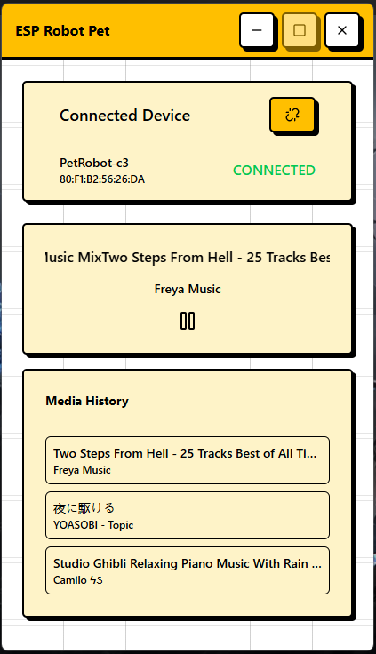

# ESP32 Robot Pet

<p align="center">
  
</p>

Aplikasi desktop berbasis Electron untuk mengontrol robot pet ESP32 melalui koneksi Bluetooth Low Energy (BLE). Aplikasi memantau media playback di Windows dan mengirimkan informasi tersebut ke perangkat ESP32 secara real-time.

Aplikasi terdiri dari dua komponen utama: frontend Electron yang menangani antarmuka pengguna dan komunikasi WebSocket, serta backend Python yang mengelola koneksi BLE dan monitoring media Windows.

## Fitur Utama

* Scan dan koneksi ke perangkat BLE ESP32
* Monitoring media playback Windows (judul lagu, artis, status play/pause)
* Monitoring amplitudo audio sistem
* Pengiriman data media ke ESP32 via BLE dalam format JSON
* Auto-reconnect saat koneksi BLE terputus
* System tray integration dengan minimize to tray
* Riwayat media playback (hingga 20 item terakhir)
* WebSocket server untuk komunikasi real-time antara frontend dan backend

## Arsitektur / Struktur Project

Aplikasi menggunakan arsitektur client-server dengan komunikasi WebSocket:

1. **Frontend (Electron)**: Menampilkan UI, mengelola state koneksi, dan berkomunikasi dengan backend via WebSocket
2. **Backend (Python)**: Menjalankan WebSocket server di port 8765, mengelola koneksi BLE, dan memantau media Windows
3. **Komunikasi**: Frontend mengirim perintah (scan, connect, disconnect) ke backend via WebSocket. Backend mengirim status koneksi dan data media kembali ke frontend, sekaligus meneruskan data ke ESP32 via BLE

```
emo-chan-gui/
├── gui/                          # Frontend Electron
│   ├── src/
│   │   ├── main/                 # Main process (window management, IPC)
│   │   ├── preload/              # Preload scripts
│   │   └── renderer/             # React UI
│   │       ├── components/       # React components
│   │       ├── contexts/        # React contexts (WebSocket, Query)
│   │       ├── lib/              # Utilities (WebSocket client, axios)
│   │       └── routes/           # TanStack Router routes
│   ├── package.json
│   └── electron.vite.config.ts
│
├── windows-listener/              # Backend Python
│   ├── main.py                   # Entry point
│   ├── lib/
│   │   ├── server.py             # WebSocket server
│   │   ├── bleManager.py         # BLE connection management
│   │   ├── listener.py           # Windows media & audio listener
│   │   └── websocketServer.py    # WebSocket base class
│   └── requirements.txt
│
└── build.bat                     # Build script untuk production
```

## Teknologi yang Digunakan

### Frontend
* **Electron**: Framework untuk aplikasi desktop cross-platform
* **React 19**: Library UI dengan hooks dan context API
* **TypeScript**: Type safety untuk kodebase
* **TanStack Router**: File-based routing dengan type safety
* **TanStack Query**: State management untuk data fetching
* **TailwindCSS**: Utility-first CSS framework
* **Radix UI**: Headless UI components
* **Vite**: Build tool dan dev server
* **Electron Vite**: Integration Vite dengan Electron

### Backend
* **Python 3**: Runtime untuk backend service
* **Bleak**: Cross-platform BLE library untuk Windows
* **WebSockets**: Protocol untuk komunikasi real-time
* **Windows SDK (winrt)**: API untuk media control dan BLE native
* **PyAudio**: Audio capture untuk monitoring amplitudo
* **NumPy**: Processing data audio
* **PyInstaller**: Packaging Python ke executable

## Cara Menjalankan Project

### Prasyarat

**Frontend:**
* Node.js 18+ dan npm
* Git

**Backend:**
* Python 3.10+
* pip
* Windows 10/11 (untuk Windows SDK dan media control)

### Instalasi

1. Clone repository:
```bash
git clone https://github.com/SukunDev/emo-chan-gui.git
cd emo-chan-gui
```

2. Install dependencies frontend:
```bash
cd gui
npm install
```

3. Install dependencies backend:
```bash
cd ../windows-listener
pip install -r requirements.txt
```

### Development Mode

**Jalankan backend secara terpisah:**
```bash
cd windows-listener
python main.py
```

Backend akan berjalan di `ws://127.0.0.1:8765`.

**Jalankan frontend:**
```bash
cd gui
npm run dev
```

Aplikasi Electron akan terbuka dengan hot reload aktif. Di mode development, backend tidak dijalankan otomatis oleh Electron (lihat `setupServer.ts`).

### Production Build

Gunakan script build yang tersedia:

```bash
# Build backend dan frontend sekaligus
build.bat

# Atau build terpisah
build_backend.bat
build_frontend.bat
```

Build akan menghasilkan:
* Backend: `windows-listener/dist/ble_bridge.exe`
* Frontend: `gui/dist/` (installer dan unpacked files)

## Konfigurasi

### Environment Variables

Tidak ada file `.env` yang digunakan saat ini. Konfigurasi hardcoded di:

* **Backend**: `windows-listener/main.py` - WebSocket server host dan port (default: `127.0.0.1:8765`)
* **Frontend**: `gui/src/main/lib/config.ts` - REST API URL (default: `http://localhost:3000`)

### Konfigurasi Backend

Di `windows-listener/lib/server.py`:
* `update_interval`: Interval pengiriman data media (default: 0.1 detik)
* `amplitude_threshold`: Threshold amplitudo untuk trigger broadcast (default: 0.01)
* `enable_audio`: Enable/disable audio amplitude monitoring (default: True)

### Electron Store

Aplikasi menggunakan `electron-store` untuk persistensi data lokal. Data disimpan di:
* Windows: `%APPDATA%\ESP32_Robot_Pet\config.json`

## Contoh Penggunaan

1. **Scan perangkat BLE:**
   - Klik tombol "SCAN" di aplikasi
   - Backend akan scan selama 5 detik dan mengembalikan daftar perangkat

2. **Koneksi ke ESP32:**
   - Pilih perangkat dari daftar hasil scan
   - Backend akan connect dan mulai monitoring media

3. **Monitoring media:**
   - Putar musik/video di aplikasi media player Windows
   - Aplikasi akan menampilkan judul, artis, dan status play/pause
   - Data dikirim ke ESP32 via BLE setiap 0.1 detik

4. **Disconnect:**
   - Klik tombol disconnect di card "Connected Device"
   - Atau tutup aplikasi (akan minimize ke system tray)

## Catatan Teknis

### Batasan

* Hanya berjalan di Windows (menggunakan Windows SDK untuk media control)
* BLE characteristic UUID harus memiliki property "write" dan "notify"
* Format data ke ESP32: JSON compact tanpa whitespace
* Media listener hanya mendeteksi aplikasi yang menggunakan Windows Media Transport Controls API

### Hal Penting untuk Developer

* **Backend di production**: Di production build, backend dijalankan sebagai child process dari Electron (`setupServer.ts`). Di development, jalankan manual.
* **BLE reconnection**: Backend memiliki auto-reconnect mechanism. Jika koneksi terputus unexpected, akan retry setiap 2 detik.
* **Media detection**: Jika media tidak terdeteksi (Unknown), aplikasi tetap mengirim data audio amplitude jika melebihi threshold.
* **System tray**: Aplikasi tidak benar-benar exit saat ditutup, melainkan minimize ke tray. Untuk exit, gunakan menu tray atau `Ctrl+Q`.
* **WebSocket reconnection**: Frontend memiliki auto-reconnect dengan delay 2 detik jika koneksi terputus.
* **Build process**: Script `build.bat` akan build backend terlebih dahulu, kemudian frontend. Pastikan Python dan Node.js tersedia di PATH.

### Troubleshooting

* **BLE tidak terdeteksi**: Pastikan Bluetooth aktif dan ESP32 dalam mode pairing
* **Media tidak terdeteksi**: Pastikan aplikasi media player menggunakan Windows Media Transport Controls (Spotify, Windows Media Player, dll)
* **Backend tidak start**: Di development, pastikan port 8765 tidak digunakan aplikasi lain
* **Audio amplitude 0**: Pastikan PyAudio terinstall dengan benar dan tidak ada konflik dengan audio driver

## Lisensi

Private / Internal Use

